# 🤖 Maršalas — Conducting AI: Agentų Organizacijos Schema

**MB „Maršalas"** — AI Empowered paslaugų įmonė: tiltas tarp AI ir žmogaus. Ši schema rodo, kaip AI agentai įsilieja į įmonės struktūrą (pagal „Conducting AI" org chart principą: kiekviena verslo funkcija turi savo agentų komandą, o žmogus lieka dirigentu).

```mermaid
flowchart TB
    CEO["👤 Žmogus — Dirigentas<br/>(strategija, sprendimai, atsakomybė)"]
    HERMES["🧠 Hermes Master<br/>Orkestratorius (5 žingsnių pipeline)"]

    CEO --> HERMES

    HERMES --> EKOM["🛒 E-komercija"]
    HERMES --> MARK["📣 Marketingas ir turinys"]
    HERMES --> KLIENT["💬 Klientų aptarnavimas"]
    HERMES --> DATA["📊 Duomenys ir analitika"]
    HERMES --> OPS["🏪 Parduotuvių operacijos"]
    HERMES --> RADAR["🛰️ Inovacijų radaras"]

    EKOM --> E1["Prekių aprašymai"]
    EKOM --> E2["Kainodara ir asortimentas"]
    EKOM --> E3["sleepingexpert.lt / cookking.online priežiūra"]

    MARK --> M1["Blogo agentai<br/>(miego žinių straipsniai)"]
    MARK --> M2["Įrašų distribucija<br/>(soc. tinklai, Telegram)"]
    MARK --> M3["Video / YouTube įkėlimas"]

    KLIENT --> K1["Užklausų atsakymai"]
    KLIENT --> K2["Konsultacijos dėl čiužinių parinkimo"]

    DATA --> D1["Verslo metrikos"]
    DATA --> D2["Kokybės kontrolė ir vertinimas"]
    DATA --> D3["Agentų taryba (council)<br/>sprendimų peržiūra"]

    OPS --> O1["Vilnius — PC Baldų Rojus"]
    OPS --> O2["Klaipėda — PC Helios"]
    OPS --> O3["Ukmergė — Kauno g. 9"]

    RADAR --> R1["AI naujovių signalai"]
    RADAR --> R2["Partnerių ir sinergijų sekimas"]

    style CEO fill:#ffd602,stroke:#142b6f,stroke-width:3px,color:#142b6f
    style HERMES fill:#142b6f,stroke:#142b6f,color:#ffffff
    style EKOM fill:#e8ecf7,stroke:#142b6f,color:#142b6f
    style MARK fill:#e8ecf7,stroke:#142b6f,color:#142b6f
    style KLIENT fill:#e8ecf7,stroke:#142b6f,color:#142b6f
    style DATA fill:#e8ecf7,stroke:#142b6f,color:#142b6f
    style OPS fill:#e8ecf7,stroke:#142b6f,color:#142b6f
    style RADAR fill:#e8ecf7,stroke:#142b6f,color:#142b6f
```

## Principas: žmogus diriguoja, agentai groja

| Lygis | Kas | Vaidmuo |
|-------|-----|---------|
| 1 | **Žmogus** | Strategija, prioritetai, galutiniai sprendimai |
| 2 | **Hermes Master** | Tikslų skaidymas į užduotis, agentų orkestravimas |
| 3 | **Sričių agentai** | Kiekviena verslo funkcija turi savo agentų komandą |
| 4 | **Kokybės grandinė** | Taryba (council) ir metrikos tikrina rezultatus prieš publikavimą |

> ✍️ Ši schema — atspirties taškas. Papildykite ją tikraisiais Hermes agentų pavadinimais (iš viso ~25 agentai) ir fazėmis (Phase 1 → Phase 2 → Phase 3 → AI-Native), kaip daroma „Conducting AI" šablonuose.

---

© 2026 MB „Maršalas". AI Empowered.
