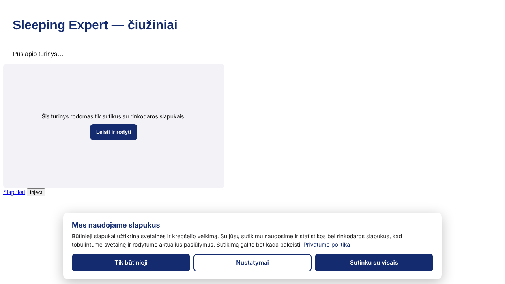

# SE Consent — savas Cookiebot pakaitalas

WordPress įskiepis slapukų sutikimams valdyti: baneris, sekiklių blokavimas iki
sutikimo, Google Consent Mode v2, sutikimų žurnalas, slapukų deklaracija, skeneris.
Funkcijų palyginimas su Cookiebot — [COOKIEBOT_ANALIZE.md](COOKIEBOT_ANALIZE.md).



## Struktūra

```
se-consent.php            įskiepio įėjimas
includes/settings.php     nustatymai, tekstai LT/EN, žinomų sekiklių taisyklės, slapukų sąrašas
includes/blocker.php      HTML filtras: sekiklių <script>/<iframe> → neaktyvūs iki sutikimo
includes/frontend.php     <head>: Consent Mode default + konfigūracija + consent.js (inline)
includes/log.php          sutikimų žurnalas (DB lentelė, REST /wp-json/se-consent/v1/log)
includes/declaration.php  [se_cookie_declaration] / [cookie_declaration]
includes/wp-consent-api.php  WP Consent API
includes/admin.php        Nustatymai → SE Consent
assets/consent.js         baneris, aktyvavimas, Consent Mode, Cookiebot API suderinamumas
tools/scan.mjs            skeneris: pažeidimai be sutikimo + nedeklaruoti slapukai
tests/                    PHP ir naršyklės (Playwright) testai
```

## Diegimas ir perėjimas nuo Cookiebot

1. **Staging'e** įkelkite aplanką `se-consent` į `wp-content/plugins/` (arba ZIP per
   *Įskiepiai → Įkelti*) ir aktyvuokite. Kol Cookiebot dar įjungtas, abu banerių nerodykite
   produkcijoje vienu metu.
2. *Nustatymai → SE Consent*: patikrinkite privatumo politikos nuorodą, tekstus,
   Consent Mode režimą (rekomenduojama **Advanced**).
3. Paleiskite skenerį prieš staging ir papildykite slapukų sąrašą:
   ```bash
   NODE_PATH=$(npm root -g) node tools/scan.mjs https://staging.sleepingexpert.lt --max 60
   ```
4. **GTM** (jei naudojamas): ištrinkite „Cookiebot CMP" žymą (template) — Consent Mode
   default dabar nustato pats įskiepis, prieš GTM. Trigeriai `cookie_consent_statistics`,
   `cookie_consent_marketing` veikia be pakeitimų. Naujiems trigeriams naudokite
   `se_consent_update` / `se_consent_ready` (dataLayer kintamasis `se_consent.marketing` ir kt.).
   Svarbu: jei GTM kodas įklijuotas temos `header.php` **prieš** `wp_head()`, perkelkite jį
   po `wp_head()` (arba į GTM4WP įskiepį) — kitaip GTM pasileis anksčiau nei Consent Mode default.
5. Išjunkite Cookiebot įskiepį / pašalinkite `uc.js` scenarijų iš temos ar GTM.
   Rankiniu būdu pažymėti scenarijai (`type="text/plain" data-cookieconsent="marketing"`)
   ir `[cookie_declaration]` trumpasis kodas veikia toliau — jų taisyti nereikia.
6. Išvalykite puslapių podėlį. Patikrinkite:
   - inkognito lange baneris rodomas, *DevTools → Application → Cookies* — nėra `_fbp`, `_ga`;
   - *Tag Assistant*: `consent default` = denied, po sutikimo `update` = granted;
   - Google Ads → *Diagnostics → Consent mode* po 1–2 dienų rodo „Active".
7. Poraštėje pridėkite `[se_consent_link]` (arba bet kurią nuorodą su `href="#se-consent"`).
8. Prenumeratą Cookiebot atšaukite tik po ~2 savaičių sėkmingo veikimo. Jei reikia senų
   sutikimų įrodymų — prieš tai eksportuokite Cookiebot žurnalą.

## Kasdienis naudojimas

- **Naujas sekiklis svetainėje** → jei jo nėra žinomų sąraše, pridėkite taisyklę
  *Blokavimas → Papildomos taisyklės* (`domenas.com | marketing`) ir slapukus į sąrašą,
  tada padidinkite **banerio versiją** (visi bus paklausti iš naujo).
- **Tikrinti be blokavimo** (tik administratoriui): `?se_consent_off=1`.
- **Žurnalas ir statistika** — *Nustatymai → SE Consent → Sutikimų žurnalas*, CSV eksportas.
- **Savaitinis skenavimas** VPS'e (cron, pirmadieniais 6:10):
  ```
  10 6 * * 1  cd /opt/se-consent && NODE_PATH=$(npm root -g) node tools/scan.mjs https://sleepingexpert.lt --max 80 --json /var/log/se-consent-scan.json
  ```
  Išeities kodas 1 = rasta pažeidimų ar nedeklaruotų slapukų (galima siųsti į Hermès/Telegram).

## Kūrėjams

JS API: `SEConsent.get()`, `SEConsent.has('marketing')`, `SEConsent.show(true)`,
`SEConsent.accept({statistics:true})`, `SEConsent.withdraw()`, `SEConsent.onChange(fn)`.
Suderinamumui taip pat yra `window.Cookiebot` / `window.CookieConsent` ir įvykiai
`CookiebotOnAccept`, `CookiebotOnDecline`, `CookiebotOnConsentReady`.

Scenarijaus neblokuoti: atributas `data-se-consent-ignore`. Rankinis žymėjimas:
`<script type="text/plain" data-se-consent="statistics">…</script>`.
PHP filtras taisyklėms: `se_consent_rules`; HTML filtravimui išjungti: `se_consent_filter_request`.

Testai:
```bash
php tests/blocker-test.php
NODE_PATH=$(npm root -g) node tests/browser-test.mjs
```
